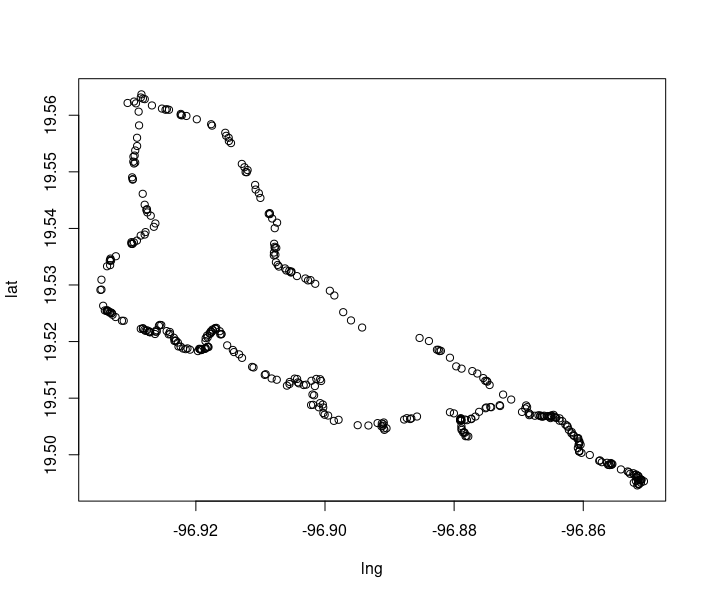

# geospatial

Some of the functions in this package use Open Source Routing Machine or OSRM which is a C ++ implementation of a high-performance routing engine for the shortest routes in road networks. The way to install OSRM using a Docker container can be found here [OSRM-Docker Container](https://github.com/FrankBaut/OSRM-SERVER).

Installation 
``` r
install.packages("devtools")
devtools::install_github("FrankBaut/geospatial")
```


``` r
library(osrm)
library(geospatial)
library(igraph)
library(shp2graph)
```

``` r
url<-"http://0.0.0.0:5000/"
options(osrm.server = url,osrm.profile = "driving")
```

``` r
data<-geospatial::route
geopoints<-geospatial::reconsted_route(data = data)
plot(geopoints)
```




``` r
```


``` r
```


``` r
```
